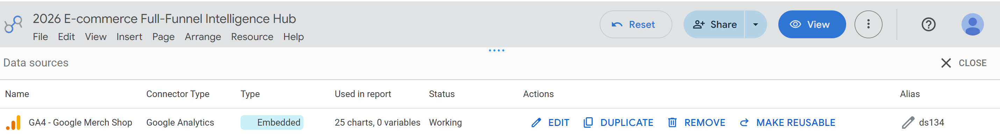
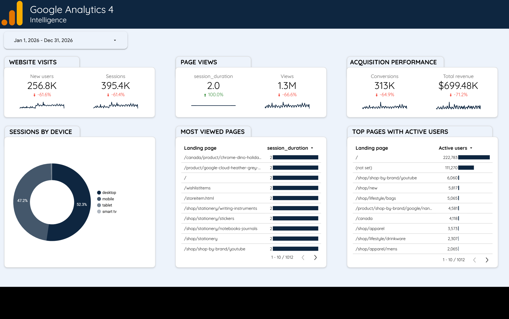
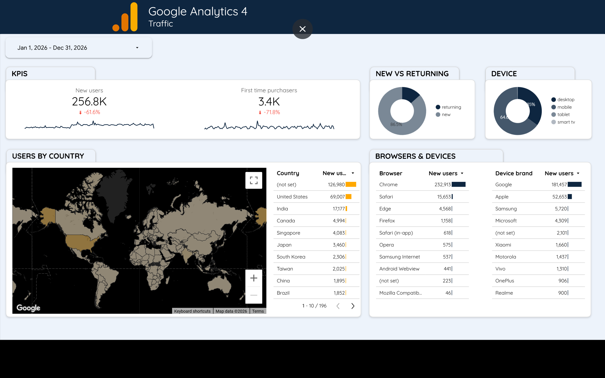
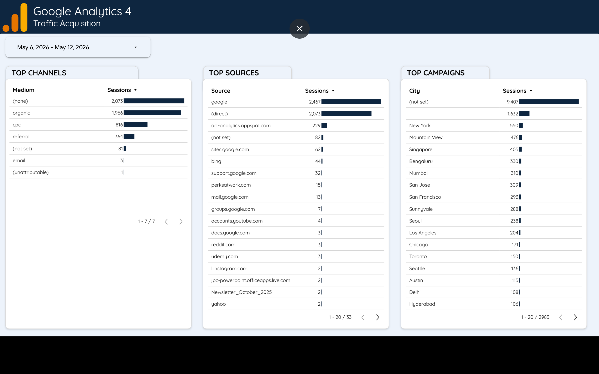
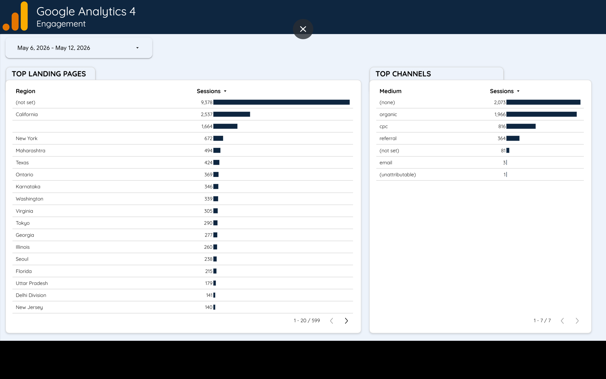
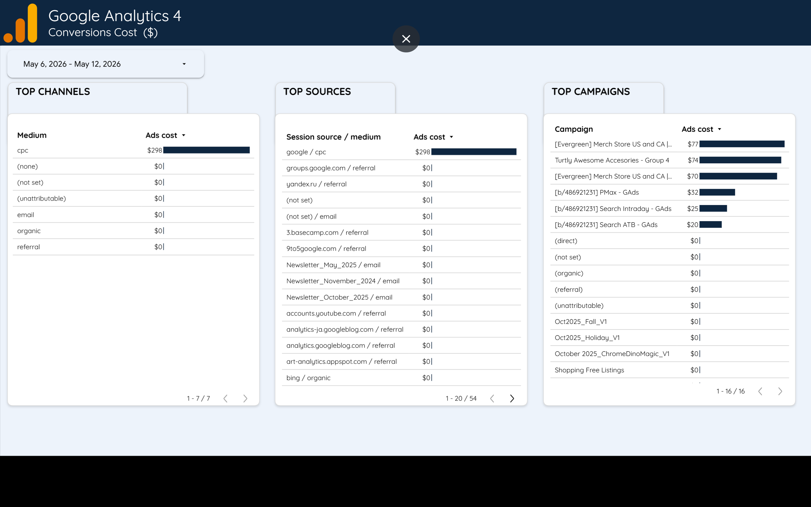

# 📊 Digital Marketing Analytics Dashboard (2026)

An end-to-end Business Intelligence project that analyzes website performance, user behavior, traffic acquisition, engagement, and conversion cost using GA4-style data and multi-page dashboard storytelling.

This project transforms raw marketing data into actionable business insights for decision-making, performance optimization, and ROI improvement.

---

# 🎯 Business Objective

Modern digital businesses struggle with:
- Rising advertising costs with unclear ROI
- High traffic but declining conversions
- Lack of visibility across marketing channels
- Fragmented user behavior insights

👉 This project solves these problems using structured data analysis and dashboard storytelling.

---

# 🧠 Key Business Insights

## 📉 Performance Challenge
- Sessions and users show a significant decline
- Revenue is decreasing despite strong traffic presence
- Conversion efficiency needs improvement

## 💰 Marketing Spend Issue
- Heavy reliance on CPC (paid advertising)
- Limited diversification of acquisition channels

## 🌐 Traffic Strength
- Strong Direct + Organic traffic performance
- Google remains the dominant acquisition source

## 🌍 Geographic Insight
- United States is the primary market
- Emerging potential in international regions

## 📱 User Behavior Insight
- Desktop slightly higher than mobile usage
- Mobile optimization opportunity identified

---

# 📊 Dashboard Overview

This project is structured into 5 analytical BI pages:

---
##  GA4-Connection for Live data

## 🧠 01. Intelligence Overview

Provides a high-level executive summary of overall business performance including:
- Users
- Sessions
- Revenue
- Conversion trends

👉 Purpose: Quick business health check

---

## 🌐 02. Traffic Overview

Analyzes website traffic trends and user growth patterns:
- Sessions over time
- New vs returning users
- Traffic performance trends

👉 Purpose: Understand overall traffic behavior

---

## 📣 03. Traffic Acquisition

Breaks down where users come from:
- Organic Search
- Direct Traffic
- Paid Ads (CPC)
- Referral sources

👉 Purpose: Identify best-performing marketing channels

---

## 📱 04. Engagement Analysis

Focuses on user behavior and interaction:
- Engagement rate
- Bounce patterns
- Device usage (mobile vs desktop)
- Session quality

👉 Purpose: Improve user experience and retention

---

## 💰 05. Conversion Cost Analysis

Evaluates marketing efficiency and revenue performance:
- Cost per acquisition (CPA)
- Campaign spend vs returns
- Conversion performance
- ROI analysis

👉 Purpose: Optimize marketing spend and profitability

---

# 🧰 Tools & Technologies

- :contentReference[oaicite:0]{index=0} (GA4 Demo Data)
- :contentReference[oaicite:1]{index=1}
- Excel / CSV data processing
- GitHub for version control and portfolio hosting

---

# 📌 Project Outcome

This project demonstrates:
✔ End-to-end BI thinking  
✔ Marketing funnel analysis (Traffic → Engagement → Conversion)  
✔ KPI-driven storytelling  
✔ Business decision-making using data  
✔ Dashboard design and analytics interpretation  

---

# 🚀 Business Impact

The analysis enables businesses to:
- Reduce wasted ad spend
- Improve conversion rates
- Identify high-performing channels
- Understand user behavior deeply
- Make data-driven marketing decisions

---

# 🔮 Future Improvements

- Predictive revenue forecasting
- Funnel drop-off analysis
- Customer segmentation modeling
- Real-time GA4 API integration
- Automated reporting pipelines

---

# 👨‍💻 Author

Built as a Business Intelligence & Digital Marketing Analytics portfolio project focused on turning raw web data into actionable business insights.

---

⭐ If you like this project, feel free to star the repository or connect for collaboration in Data Analytics / BI / Marketing Analytics.
